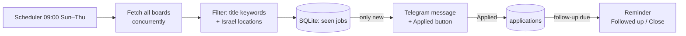

# job-bot

A personal Telegram assistant for a DevOps job search in Israel.

- Every morning (Sun–Thu, 09:00 Israel time) it checks company career boards and sends **only the new** DevOps / SRE / Platform / Cloud jobs in Israel.
- Every job has buttons: **✅ Applied** and **🙈 Not for me**.
- Tap **Applied** and it reminds you **to follow up after 7 days**. When you get the reminder, tap **📨 Followed up** (next reminder in another 7 days) or **🗄 Close**.

Jobs come from the official public JSON APIs behind companies' own career pages (Greenhouse, Lever, Ashby). There's no scraping and no LinkedIn automation.

## Commands

| Command | What it does |
|---|---|
| `/start` | Shows your chat id (needed for setup) |
| `/jobs` | Check for new jobs right now |
| `/all` | Every matching open job, including ones already sent |
| `/applied Wiz - Senior DevOps Engineer https://…` | Track an application you found elsewhere (role and link optional) |
| `/followups` | Active applications with their follow-up dates |
| `/companies` | Companies being watched and keywords |
| `/stats` | Jobs found / active / closed applications |

## Setup

1. Create a bot with [@BotFather](https://t.me/BotFather) (`/newbot`) and copy the token.
2. `cp .env.example .env` and set `TELEGRAM_TOKEN`.
3. `docker compose up -d --build`, then send `/start` to the bot. It replies with your chat id.
4. Put the chat id in `ALLOWED_CHAT_IDS` in `.env`, then `docker compose up -d --force-recreate`.
5. Send `/jobs`. The first run sends every matching open job; after that, only new ones.

Without Docker: `make install`, then `make run`.

## Customizing the search (`config/search.yaml`)

- `keywords`: whole-word, case-insensitive match on the job title (`devops`, `sre`, `site reliability`, `platform engineer`, …)
- `exclude`: skip titles containing these words (`intern`, `director`, …)
- `locations` / `countries`: the job matches if any location contains one of these (Tel Aviv, Herzliya, Haifa, …) or the country code is `IL`
- `digest_time`, `digest_days`, `followup_days`, `max_jobs_per_digest`
- `companies`: add any company that hosts its careers page on a supported board. The slug comes from the careers URL:

| Board | Careers URL looks like | Config |
|---|---|---|
| Greenhouse | `job-boards.greenhouse.io/wizinc` | `{name: Wiz, source: greenhouse, slug: wizinc}` |
| Lever | `jobs.lever.co/<slug>` | `{name: …, source: lever, slug: <slug>}` |
| Ashby | `jobs.ashbyhq.com/<slug>` | `{name: …, source: ashby, slug: <slug>}` |

After editing, run `docker compose restart`. If a board can't be reached, the digest says so ("⚠️ Couldn't reach: …") and every other company is still checked.

> Many Israeli companies use Comeet or their own career sites, which aren't supported yet. Those are good candidates for the next source module (`app/sources.py`).

## How it works



- `app/sources.py`: one fetcher per board, normalized into a single `Job` model; one failing board never breaks the run
- `app/matching.py`: keyword and location filter
- `app/storage.py`: SQLite for seen jobs and applications, stored in a Docker volume
- `app/main.py`: Telegram commands, inline buttons, daily job

## Development

```bash
make install
make lint test   # tests use mocked HTTP, no network needed
```
